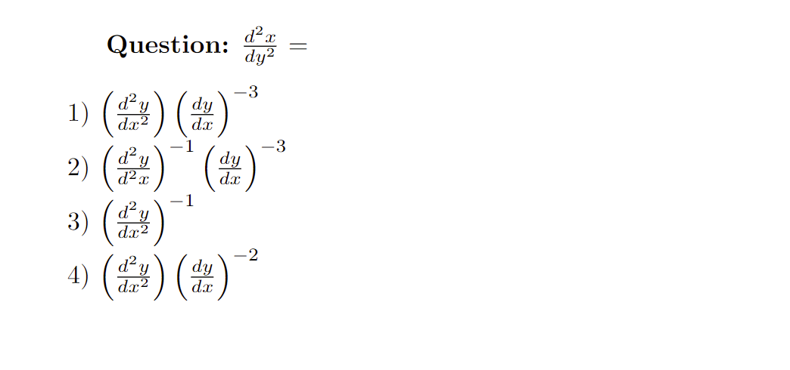
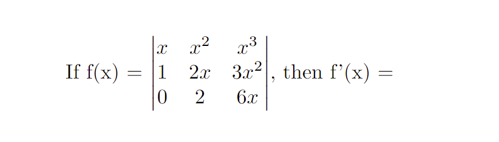
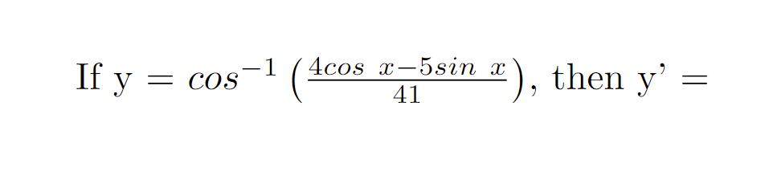
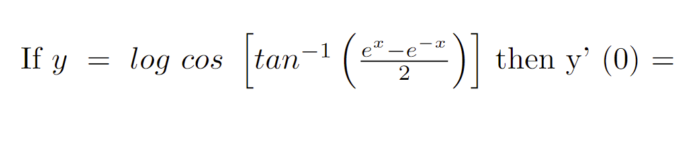
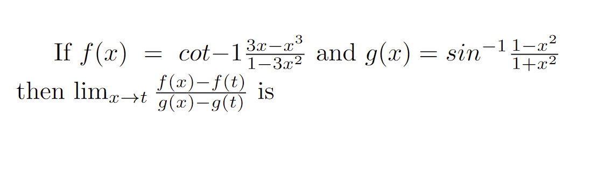
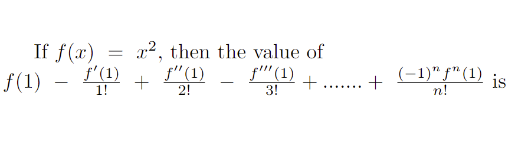
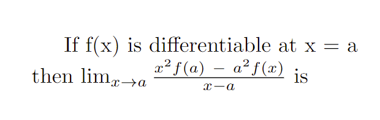

<!DOCTYPE html>
<html lang="en">

<head>
    <meta charset="utf-8">
    <meta name="viewport" content="width=device-width, initial-scale=1.0, maximum-scale=1.0, user-scalable=no">
    <meta http-equiv="X-UA-Compatible" content="IE=edge">
    <meta name="description" content="">
    <meta name="author" content="">
    
    <title>Differentiation and Differentiability JEE main mock test</title>
    
    
    <link href="css/custom.css" rel="stylesheet" />
    <link href="css/bootstrap.min.css" rel="stylesheet" />
   
    <!-- Global site tag (gtag.js) - Google Analytics -->
    
</head>

<body>
    

        

            

                

                    
 

                

            

        

        

        
        

        

        

            

                

                    

                    <td class="full-width"><h1 class="full-width"> Differentiability and Differentiation JEE mains mock test</h1></td>
                    
                

                

                    

                                                
                        <td style="padding: 0px 5px;">Remaining Time</td>
                        <td>
                            : 00:00:00
                        </td>
                        
                        <input type="hidden" id="hdfTestDuration" value="60" />
                    

                

			

		

        

            

                

                    

                        <table style="width: 100%">
                            <tr>
                                <td>
                                    

                                        

                                            

                                                

                                                    

                                                        <input type="hidden" value="1" class="hdfQuestionID">
                                                        <input type="hidden" value="1" class="hdfPaperSetID">
                                                        <input type="hidden" value="2" class="hdfCurrectAns">
                                                        

                                                            <h4 class="question-title"> Question 1: </h4> 
                                                            <table class="table table-borderless mb0">
                                                                <tbody>
                                                                    If x = log t and y = t2 -1 , then y''(1) at t = 1 is 
                                                                    <tr>
                                                                        <td> <input type="radio" value="1" name="radiospage01" id="rOption1_1"> 1 ) 2</td>
                                                                    </tr>
                                                                    <tr>
                                                                        <td> <input type="radio" value="2" name="radiospage01" id="rOption1_1"> 2 ) 4</td>
                                                                    </tr>
                                                                    <tr>
                                                                        <td> <input type="radio" value="3" name="radiospage01" id="rOption1_1"> 3 ) 3</td>
                                                                    </tr>
                                                                    <tr>
                                                                        <td> <input type="radio" value="4" name="radiospage01" id="rOption1_1"> 4 ) none of the above</td>
                                                                    </tr>
                                                                </tbody>
                                                            </table>
                                                            <h4 class="question-footer">  </h4>
                                                        

                                                    

                                                    

                                                        <input type="hidden" value="1" class="hdfQuestionID">
                                                        <input type="hidden" value="1" class="hdfPaperSetID">
                                                        <input type="hidden" value="4" class="hdfCurrectAns">
                                                        

                                                            <h4 class="question-title"> Question 2:   </h4>
                                                              
                                                            <table class="table table-borderless mb0">
                                                                <tbody>
                                                                    Let f be defined in <b>R</b> by f(x)=4 sin (1/x), if x &#8800; 0 and f(0) = 0 then
                                                                    <tr>
                                                                        <td> <input type="radio" value="1" name="radiospage02" id="rOption2_1"> 1 ) f' (0) doesn't exist</td>
                                                                    </tr>
                                                                    <tr>
                                                                        <td> <input type="radio" value="2" name="radiospage02" id="rOption2_1"> 2 ) f' (2-) doesn't exist</td>
                                                                    </tr>
                                                                    <tr>    
                                                                        <td> <input type="radio" value="3" name="radiospage02" id="rOption2_1"> 3 ) f'' is not continuous at x = 0</td>
                                                                    </tr>
                                                                    <tr>
                                                                        <td> <input type="radio" value="4" name="radiospage02" id="rOption2_1"> 4 ) f''(0) exists but f'' i not continuous at x=0</td>
                                                                    </tr>
                                                                </tbody>
                                                            </table>
                                                            <h4 class="question-footer">  </h4>
                                                        

                                                    

                                                    

                                                        <input type="hidden" value="1" class="hdfQuestionID">
                                                        <input type="hidden" value="1" class="hdfPaperSetID">
                                                        <input type="hidden" value="1" class="hdfCurrectAns">
                                                        

                                                            <h4 class="question-title"> Question 3:  </h4>
                                                            
                                                            <table class="table table-borderless mb0">
                                                                <tbody>
                                                                    If f is one-one and satisfies f' (x) = 
                                                                    
                                                                        &radic;&nbsp;(1-(f(x)2)&nbsp;
                                                                         then (f-1)'(x) = 
                                                                    <tr>
                                                                        <td> <input type="radio" value="1" name="radiospage03" id="rOption3_1"> 1 )  
                                                                          

                                                                            1
                                                                            
                                                                            
                                                                                &radic;&nbsp;1-x2&nbsp;
                                                                                
                                                                            
                                                                          
</td>
                                                                    </tr>
                                                                    <tr>
                                                                        <td> <input type="radio" value="2" name="radiospage03" id="rOption3_1"> 2 ) may nto exist for every x &Epsilon; <b>R</b></td>
                                                                    </tr>
                                                                    <tr>
                                                                        <td> <input type="radio" value="3" name="radiospage03" id="rOption3_1"> 3 ) sin-1 (f(x))</td>
                                                                    </tr>
                                                                    <tr>
                                                                        <td> <input type="radio" value="4" name="radiospage03" id="rOption3_1"> 4 ) can't be known explicitly</td>
                                                                    </tr>
                                                                </tbody>
                                                            </table>
                                                            <h4 class="question-footer">  </h4>
                                                        

                                                    

                                                    

                                                        <input type="hidden" value="1" class="hdfQuestionID">
                                                        <input type="hidden" value="1" class="hdfPaperSetID">
                                                        <input type="hidden" value="2" class="hdfCurrectAns">
                                                        

                                                            <h4 class="question-title"> Question 4:  </h4>
                                                            <table class="table table-borderless mb0">
                                                                <tbody>
                                                                    The least value of n so that yn = yn+1 where y = x2 + ex
                                                                    <tr>
                                                                        <td> <input type="radio" value="1" name="radiospage04" id="rOption4_1"> 1 ) 4</td>
                                                                    </tr>
                                                                    <tr>
                                                                        <td> <input type="radio" value="2" name="radiospage04" id="rOption4_1"> 2 ) 3</td>
                                                                    </tr>
                                                                    <tr>
                                                                        <td> <input type="radio" value="3" name="radiospage04" id="rOption4_1"> 3 ) 2</td>
                                                                    </tr>
                                                                    <tr>
                                                                        <td> <input type="radio" value="4" name="radiospage04" id="rOption4_1"> 4 ) 5</td>
                                                                    </tr>
                                                                </tbody>
                                                            </table>
                                                            <h4 class="question-footer">  </h4>
                                                        

                                                    

                                                    

                                                        <input type="hidden" value="1" class="hdfQuestionID">
                                                        <input type="hidden" value="1" class="hdfPaperSetID">
                                                        <input type="hidden" value="2" class="hdfCurrectAns">
                                                        

                                                            <h4 class="question-title"> Question 5:  </h4>
                                                              
                                                            <table class="table table-borderless mb0">
                                                                <tbody>
                                                                    
                                                                    <tr>
                                                                        <td> <input type="radio" value="1" name="radiospage05" id="rOption5_1"> 1 ) cos 2x</td>
                                                                    </tr>
                                                                    <tr>
                                                                        <td> <input type="radio" value="2" name="radiospage05" id="rOption5_1"> 2 ) - cos 2x</td>
                                                                    </tr>
                                                                    <tr>
                                                                        <td> <input type="radio" value="3" name="radiospage05" id="rOption5_1"> 3 ) 2 cos2 x</td>
                                                                    </tr>
                                                                    <tr>
                                                                        <td> <input type="radio" value="4" name="radiospage05" id="rOption5_1"> 4 ) cos2 x</td>
                                                                    </tr>
                                                                </tbody>
                                                            </table>
                                                            <h4 class="question-footer">  </h4>
                                                        

                                                    

                                                    

                                                        <input type="hidden" value="1" class="hdfQuestionID">
                                                        <input type="hidden" value="1" class="hdfPaperSetID">
                                                        <input type="hidden" value="1" class="hdfCurrectAns">
                                                        

                                                            <h4 class="question-title"> Question 6:  </h4>
                                                              
                                                            <table class="table table-borderless mb0">
                                                                <tbody>
                                                                    <tr>
                                                                        <td> <input type="radio" value="1" name="radiospage06" id="rOption6_1"> 1 ) </td>
                                                                    </tr>
                                                                    <tr>
                                                                        <td> <input type="radio" value="2" name="radiospage06" id="rOption6_1"> 2 ) </td>
                                                                    </tr>
                                                                    <tr>
                                                                        <td> <input type="radio" value="3" name="radiospage06" id="rOption6_1"> 3 ) </td>
                                                                    </tr>
                                                                    <tr>
                                                                        <td> <input type="radio" value="4" name="radiospage06" id="rOption6_1"> 4 ) </td>
                                                                    </tr>
                                                                </tbody>
                                                            </table>
                                                            <h4 class="question-footer">  </h4>
                                                        

                                                    

                                                    

                                                        <input type="hidden" value="1" class="hdfQuestionID">
                                                        <input type="hidden" value="1" class="hdfPaperSetID">
                                                        <input type="hidden" value="4" class="hdfCurrectAns">
                                                        

                                                            <h4 class="question-title"> Question 7:  </h4>
                                                              
                                                            <table class="table table-borderless mb0">
                                                                <tbody>
                                                                    <tr>
                                                                        <td> <input type="radio" value="1" name="radiospage07" id="rOption7_1"> 1 ) 6x3</td>
                                                                    </tr>
                                                                    <tr>
                                                                        <td> <input type="radio" value="2" name="radiospage07" id="rOption7_1"> 2 ) x3 + 6x2</td>
                                                                    </tr>
                                                                    <tr>
                                                                        <td> <input type="radio" value="3" name="radiospage07" id="rOption7_1"> 3 ) 3x</td>
                                                                    </tr>
                                                                    <tr>
                                                                        <td> <input type="radio" value="4" name="radiospage07" id="rOption7_1"> 4 ) 6x2</td>
                                                                    </tr>
                                                                </tbody>
                                                            </table>
                                                            <h4 class="question-footer">  </h4>
                                                        

                                                    

                                                    

                                                        <input type="hidden" value="1" class="hdfQuestionID">
                                                        <input type="hidden" value="1" class="hdfPaperSetID">
                                                        <input type="hidden" value="1" class="hdfCurrectAns">
                                                        

                                                            <h4 class="question-title"> Question 8:  </h4>
                                                            <table class="table table-borderless mb0">
                                                                <tbody> 
                                                                    Let y = - log (1+x)  
                                                                        <b>Statement 1:</b> y'(1) = 1/2  
                                                                        <b>Statement 2:</b> xy' + 1 =ey
                                                                    <tr>
                                                                        <td> <input type="radio" value="1" name="radiospage08" id="rOption8_1"> 1 ) Both are true and statement 2 is the correct explanation of satement 1</td>
                                                                    </tr>
                                                                    <tr>
                                                                        <td> <input type="radio" value="2" name="radiospage08" id="rOption8_1"> 2 ) Both are true, but statement 2 is not the correct explanation of satement 1</td>
                                                                    </tr>
                                                                    <tr>
                                                                        <td> <input type="radio" value="3" name="radiospage08" id="rOption8_1"> 3 ) statement 1 is true and statemet 2 is false</td>
                                                                    </tr>
                                                                    <tr>
                                                                        <td> <input type="radio" value="4" name="radiospage08" id="rOption8_1"> 4 ) statement 1 is false while statement 2 is true</td>
                                                                    </tr>
                                                                </tbody>
                                                            </table>
                                                            <h4 class="question-footer">  </h4>
                                                        

                                                    

                                                    

                                                        <input type="hidden" value="1" class="hdfQuestionID">
                                                        <input type="hidden" value="1" class="hdfPaperSetID">
                                                        <input type="hidden" value="4" class="hdfCurrectAns">
                                                        

                                                            <h4 class="question-title"> Question 9:  </h4>
                                                            <table class="table table-borderless mb0">
                                                                <tbody>
                                                                    For a differentiable function f on <b>R</b> here is an x0 with f '(x) = 1/2[f '(0)+f '(1)]
                                                                    <tr>
                                                                        <td> <input type="radio" value="1" name="radiospage09" id="rOption9_1"> 1 ) only is f is constant</td>
                                                                    </tr>
                                                                    <tr>
                                                                        <td> <input type="radio" value="2" name="radiospage09" id="rOption9_1"> 2 ) only if f is increasing</td>
                                                                    </tr>
                                                                    <tr>
                                                                        <td> <input type="radio" value="3" name="radiospage09" id="rOption9_1"> 3 ) if f is decreasing</td>
                                                                    </tr><tr>
                                                                        <td> <input type="radio" value="4" name="radiospage09" id="rOption9_1"> 4 ) if f is continuously differentiable</td>
                                                                    </tr>
                                                                </tbody>
                                                            </table>
                                                            <h4 class="question-footer">  </h4>
                                                        

                                                    

                                                    

                                                        <input type="hidden" value="1" class="hdfQuestionID">
                                                        <input type="hidden" value="1" class="hdfPaperSetID">
                                                        <input type="hidden" value="2" class="hdfCurrectAns">
                                                        

                                                            <h4 class="question-title"> Question 10:  </h4>
                                                            <table class="table table-borderless mb0">
                                                                <tbody>
                                                                    If xy = ex-y then
                                                                    <tr>
                                                                        <td> <input type="radio" value="1" name="radiospage10" id="rOption10_1"> 1 ) y ' doesn't exist at x = 1</td>
                                                                    </tr>
                                                                    <tr>
                                                                        <td> <input type="radio" value="2" name="radiospage10" id="rOption10_1"> 2 ) y ' = 0 at x = 1</td>
                                                                    </tr>
                                                                    <tr>
                                                                        <td> <input type="radio" value="3" name="radiospage10" id="rOption10_1"> 3 ) y ' = 1/2 at x = e</td>
                                                                    </tr>
                                                                    <tr>
                                                                        <td> <input type="radio" value="4" name="radiospage10" id="rOption10_1"> 4 ) None of the above</td>
                                                                    </tr>
                                                                </tbody>
                                                            </table>
                                                            <h4 class="question-footer">  </h4>
                                                        

                                                    

                                                    

                                                        <input type="hidden" value="1" class="hdfQuestionID">
                                                        <input type="hidden" value="1" class="hdfPaperSetID">
                                                        <input type="hidden" value="2" class="hdfCurrectAns">
                                                        

                                                            <h4 class="question-title"> Question 11:  </h4>
                                                            <table class="table table-borderless mb0">
                                                                <tbody>
                                                                    The function x = sin-1 (t2 - 1), y = cos-1 2t then   
                                                                      

                                                                        dy
                                                                        
                                                                        dx
                                                                        
                                                                      
 at x = 0
                                                                    <tr>
                                                                        <td> <input type="radio" value="1" name="radiospage11" id="rOption11_1"> 1 ) 
                                                                            &radic;&nbsp;2&nbsp;
                                                                            </td>
                                                                    </tr>
                                                                    <tr>    <td> <input type="radio" value="2" name="radiospage11" id="rOption11_1"> 2 ) -
                                                                            &radic;&nbsp;2&nbsp;
                                                                            </td>
                                                                    </tr>
                                                                    <tr>
                                                                        <td> <input type="radio" value="3" name="radiospage11" id="rOption11_1"> 3 ) 2</td>
                                                                    </tr>
                                                                    <tr>
                                                                        <td> <input type="radio" value="4" name="radiospage11" id="rOption11_1"> 4 ) -2</td>
                                                                    </tr>
                                                                </tbody>
                                                            </table>
                                                            <h4 class="question-footer">  </h4>
                                                        

                                                    

                                                    

                                                        <input type="hidden" value="1" class="hdfQuestionID">
                                                        <input type="hidden" value="1" class="hdfPaperSetID">
                                                        <input type="hidden" value="3" class="hdfCurrectAns">
                                                        

                                                            <h4 class="question-title"> Question 12:  </h4>
                                                            <table class="table table-borderless mb0">
                                                                <tbody>
                                                                    If g(t) = 
                                                                        &radic;&nbsp;t3-1&nbsp;
                                                                         , then g'(2)=
                                                                    <tr>
                                                                        <td> <input type="radio" value="1" name="radiospage12" id="rOption12_1"> 1 ) -1</td>
                                                                    </tr>
                                                                    <tr>
                                                                        <td> <input type="radio" value="2" name="radiospage12" id="rOption12_1"> 2 ) 1/2</td>
                                                                    </tr>
                                                                    <tr>
                                                                        <td> <input type="radio" value="3" name="radiospage12" id="rOption12_1"> 3 ) 2</td>
                                                                    </tr>
                                                                    <tr>
                                                                        <td> <input type="radio" value="4" name="radiospage12" id="rOption12_1"> 4 ) -4</td>
                                                                    </tr>
                                                                </tbody>
                                                            </table>
                                                            <h4 class="question-footer">  </h4>
                                                        

                                                    

                                                    

                                                        <input type="hidden" value="1" class="hdfQuestionID">
                                                        <input type="hidden" value="1" class="hdfPaperSetID">
                                                        <input type="hidden" value="1" class="hdfCurrectAns">
                                                        

                                                            <h4 class="question-title"> Question 13:  </h4>
                                                            <table class="table table-borderless mb0">
                                                                <tbody>
                                                                    The function y = sin^{-1} x satisfies
                                                                    <tr>
                                                                        <td> <input type="radio" value="1" name="radiospage13" id="rOption13_1"> 1 ) (1-x2) y'' = xy'</td>
                                                                    </tr>
                                                                    <tr>
                                                                        <td> <input type="radio" value="2" name="radiospage13" id="rOption13_1"> 2 ) (1-x2) y'' = xy''</td>
                                                                    </tr>
                                                                    <tr>
                                                                        <td> <input type="radio" value="3" name="radiospage13" id="rOption13_1"> 3 ) (1-x2) y'' = x2y''</td>
                                                                    </tr>
                                                                    <tr>
                                                                        <td> <input type="radio" value="4" name="radiospage13" id="rOption13_1"> 4 ) (1-x2) y'' = 2xy''</td>
                                                                    </tr>
                                                                </tbody>
                                                            </table>
                                                            <h4 class="question-footer">  </h4>
                                                        

                                                    

                                                    

                                                        <input type="hidden" value="1" class="hdfQuestionID">
                                                        <input type="hidden" value="1" class="hdfPaperSetID">
                                                        <input type="hidden" value="2" class="hdfCurrectAns">
                                                        

                                                            <h4 class="question-title"> Question 14:  </h4>
                                                              
                                                            <table class="table table-borderless mb0">
                                                                <tbody>
                                                                    <tr>
                                                                        <td> <input type="radio" value="1" name="radiospage14" id="rOption14_1"> 1 ) 0</td>
                                                                    </tr>
                                                                    <tr>
                                                                        <td> <input type="radio" value="2" name="radiospage14" id="rOption14_1"> 2 ) 1</td>
                                                                    </tr>
                                                                    <tr>
                                                                        <td> <input type="radio" value="3" name="radiospage14" id="rOption14_1"> 3 ) -1</td>
                                                                    </tr>
                                                                    <tr>    
                                                                        <td> <input type="radio" value="4" name="radiospage14" id="rOption14_1"> 4 ) 4</td>
                                                                    </tr>
                                                                </tbody>
                                                            </table>
                                                            <h4 class="question-footer">  </h4>
                                                        

                                                    

                                                    

                                                        <input type="hidden" value="1" class="hdfQuestionID">
                                                        <input type="hidden" value="1" class="hdfPaperSetID">
                                                        <input type="hidden" value="4" class="hdfCurrectAns">
                                                        

                                                            <h4 class="question-title"> Question 15:  </h4>
                                                              
                                                            <table class="table table-borderless mb0">
                                                                <tbody>
                                                                    <tr>
                                                                        <td> <input type="radio" value="1" name="radiospage15" id="rOption15_1"> 1 ) e + e-1</td>
                                                                    </tr>
                                                                    <tr>
                                                                        <td> <input type="radio" value="2" name="radiospage15" id="rOption15_1"> 2 ) e - e-1</td>
                                                                    </tr><tr>    
                                                                        <td> <input type="radio" value="3" name="radiospage15" id="rOption15_1"> 3 ) e-1 - e</td>
                                                                    </tr>
                                                                    <tr>    
                                                                        <td> <input type="radio" value="4" name="radiospage15" id="rOption15_1"> 4 ) none of the above</td>
                                                                    </tr>
                                                                </tbody>
                                                            </table>
                                                            <h4 class="question-footer">  </h4>
                                                        

                                                    

                                                    

                                                        <input type="hidden" value="1" class="hdfQuestionID">
                                                        <input type="hidden" value="1" class="hdfPaperSetID">
                                                        <input type="hidden" value="4" class="hdfCurrectAns">
                                                        

                                                            <h4 class="question-title"> Question 16:  </h4>
                                                              
                                                            <table class="table table-borderless mb0">
                                                                <tbody>
                                                                    <tr>
                                                                        <td> <input type="radio" value="1" name="radiospage16" id="rOption16_1"> 1 ) 
                                                                              
                                                                            

                                                                              3
                                                                              
                                                                              2(t2+1)
                                                                              
                                                                            
 </td>
                                                                    </tr>
                                                                    <tr>
                                                                        <td> <input type="radio" value="2" name="radiospage16" id="rOption16_1"> 2 ) 
                                                                              
                                                                            

                                                                              5
                                                                              
                                                                              2(t2+1)
                                                                              
                                                                            
</td>
                                                                    </tr>
                                                                    <tr>
                                                                        <td> <input type="radio" value="3" name="radiospage16" id="rOption16_1"> 3 ) 
                                                                              
                                                                            

                                                                              5
                                                                              
                                                                              2
                                                                              
                                                                            
</td>
                                                                    </tr>
                                                                    <tr>
                                                                        <td> <input type="radio" value="4" name="radiospage16" id="rOption16_1"> 4 ) 
                                                                              
                                                                            

                                                                              3
                                                                              
                                                                              2
                                                                              
                                                                            
</td>
                                                                    </tr>
                                                                </tbody>
                                                            </table>
                                                            <h4 class="question-footer">  </h4>
                                                        

                                                    

                                                    

                                                        <input type="hidden" value="1" class="hdfQuestionID">
                                                        <input type="hidden" value="1" class="hdfPaperSetID">
                                                        <input type="hidden" value="1" class="hdfCurrectAns">
                                                        

                                                            <h4 class="question-title"> Question 17:  </h4>
                                                            <table class="table table-borderless mb0">
                                                                <tbody>
                                                                    If 2x + 2y = 2x+y, then the value of 
                                                                      

                                                                        dy
                                                                        
                                                                        dx
                                                                        
                                                                      
 at x = y = 1
                                                                    <tr>
                                                                        <td> <input type="radio" value="1" name="radiospage17" id="rOption17_1"> 1 ) -1</td>
                                                                    </tr>
                                                                    <tr>
                                                                        <td> <input type="radio" value="2" name="radiospage17" id="rOption17_1"> 2 ) 0</td>
                                                                    </tr>
                                                                    <tr>
                                                                        <td> <input type="radio" value="3" name="radiospage17" id="rOption17_1"> 3 ) 1</td>
                                                                    </tr>
                                                                    <tr>
                                                                        <td> <input type="radio" value="4" name="radiospage17" id="rOption17_1"> 4 ) 2</td>
                                                                    </tr>
                                                                </tbody>
                                                            </table>
                                                            <h4 class="question-footer">  </h4>
                                                        

                                                    

                                                    

                                                        <input type="hidden" value="1" class="hdfQuestionID">
                                                        <input type="hidden" value="1" class="hdfPaperSetID">
                                                        <input type="hidden" value="4" class="hdfCurrectAns">
                                                        

                                                            <h4 class="question-title"> Question 18:  </h4>
                                                            <table class="table table-borderless mb0">
                                                                <tbody>
                                                                    Let (x, y) be any point on the unit circle with centre at origin, then
                                                                    <tr>
                                                                        <td> <input type="radio" value="1" name="radiospage18" id="rOption18_1"> 1 ) y'' + y'2 -1</td>
                                                                    </tr>
                                                                    <tr>
                                                                        <td> <input type="radio" value="2" name="radiospage18" id="rOption18_1"> 2 ) y'' + 2y'2 +1</td>
                                                                    </tr>
                                                                    <tr>
                                                                        <td> <input type="radio" value="3" name="radiospage18" id="rOption18_1"> 3 ) y'' - 2y'2 +1</td>
                                                                    </tr>
                                                                    <tr>
                                                                        <td> <input type="radio" value="4" name="radiospage18" id="rOption18_1"> 4 ) y'' + y'2 +1</td>
                                                                    </tr>
                                                                </tbody>
                                                            </table>
                                                            <h4 class="question-footer">  </h4>
                                                        

                                                    

                                                    

                                                        <input type="hidden" value="1" class="hdfQuestionID">
                                                        <input type="hidden" value="1" class="hdfPaperSetID">
                                                        <input type="hidden" value="1" class="hdfCurrectAns">
                                                        

                                                            <h4 class="question-title"> Question 19:  </h4>
                                                            <table class="table table-borderless mb0">
                                                                <tbody>
                                                                    The derivative of f(tan x) with respect to g(sec x) at x= &pi;/4, where f '(1) = 2 and g ' (
                                                                        &radic;&nbsp;2&nbsp;) = 4, is:
                                                                        
                                                                    <tr>
                                                                        <td> <input type="radio" value="1" name="radiospage19" id="rOption19_1"> 1 ) 1/
                                                                            &radic;&nbsp;2&nbsp;
                                                                            </td>
                                                                    </tr>
                                                                    <tr>
                                                                        <td> <input type="radio" value="2" name="radiospage19" id="rOption19_1"> 2 ) 
                                                                            &radic;&nbsp;2&nbsp;
                                                                            </td>
                                                                    </tr>
                                                                    <tr>
                                                                        <td> <input type="radio" value="3" name="radiospage19" id="rOption19_1"> 3 ) 1</td>
                                                                    </tr>
                                                                    <tr>    
                                                                        <td> <input type="radio" value="4" name="radiospage19" id="rOption19_1"> 4 ) 0</td>
                                                                    </tr>
                                                                </tbody>
                                                            </table>
                                                            <h4 class="question-footer">  </h4>
                                                        

                                                    

                                                    

                                                        <input type="hidden" value="1" class="hdfQuestionID">
                                                        <input type="hidden" value="1" class="hdfPaperSetID">
                                                        <input type="hidden" value="4" class="hdfCurrectAns">
                                                        

                                                            <h4 class="question-title"> Question 20:  </h4>
                                                            <table class="table table-borderless mb0">
                                                                <tbody>
                                                                    For a real number y, let [y] denote the greatest integer less than equal to y. Then f(x) = 
                                                                      </style>
                                                                      

                                                                        tan (&pi; [ x- &pi; ]
                                                                        
                                                                        1 + [x]2
                                                                        
                                                                      
 is
                                                                    <tr>
                                                                        <td> <input type="radio" value="1" name="radiospage20" id="rOption20_1"> 1 ) discontinuous at some x</td>
                                                                    </tr>
                                                                    <tr>
                                                                        <td> <input type="radio" value="2" name="radiospage20" id="rOption20_1"> 2 ) continououse at all x, but the derivative f '(x) does not exist for some x</td>
                                                                    </tr>
                                                                    <tr>
                                                                        <td> <input type="radio" value="3" name="radiospage20" id="rOption20_1"> 3 ) f '(x) exists for all x but the second derivative f''(x) doesn't exist</td>
                                                                    <tr>
                                                                        <td> <input type="radio" value="4" name="radiospage20" id="rOption20_1"> 4 ) f '(x) exists of all x</td>
                                                                    </tr>
                                                                </tbody>
                                                            </table>
                                                            <h4 class="question-footer">  </h4>
                                                        

                                                    

                                                    

                                                        <input type="hidden" value="1" class="hdfQuestionID">
                                                        <input type="hidden" value="1" class="hdfPaperSetID">
                                                        <input type="hidden" value="4" class="hdfCurrectAns">
                                                        

                                                            <h4 class="question-title"> Question 21:  </h4>
                                                              
                                                            <table class="table table-borderless mb0">
                                                                <tbody>
                                                                    <tr>
                                                                        <td> <input type="radio" value="1" name="radiospage21" id="rOption21_1"> 1 ) 2n-1</td>
                                                                    </tr>
                                                                    <tr>    
                                                                        <td> <input type="radio" value="2" name="radiospage21" id="rOption21_1"> 2 ) 0</td>
                                                                    </tr>
                                                                    <tr>    
                                                                        <td> <input type="radio" value="3" name="radiospage21" id="rOption21_1"> 3 ) 1</td>
                                                                    </tr>
                                                                    <tr>    
                                                                        <td> <input type="radio" value="4" name="radiospage21" id="rOption21_1"> 4 ) 2n</td>
                                                                    </tr>
                                                                </tbody>
                                                            </table>
                                                            <h4 class="question-footer">  </h4>
                                                        

                                                    

                                                    

                                                        <input type="hidden" value="1" class="hdfQuestionID">
                                                        <input type="hidden" value="1" class="hdfPaperSetID">
                                                        <input type="hidden" value="4" class="hdfCurrectAns">
                                                        

                                                            <h4 class="question-title"> Question 22:  </h4>
                                                            <table class="table table-borderless mb0">
                                                                <tbody>
                                                                    f(x) and g(x) are two differential function on [0,2] such that f''(x) - g''(x), f'(1) = 2g'(!) = 4, f(2) = 3g(2) = 9 then f(x) - g(x) at x = 3/2 is
                                                                    <tr>
                                                                        <td> <input type="radio" value="1" name="radiospage22" id="rOption22_1"> 1 ) 0</td>
                                                                    </tr>
                                                                    <tr>
                                                                        <td> <input type="radio" value="2" name="radiospage22" id="rOption22_1"> 2 ) 2</td>
                                                                    </tr>
                                                                    <tr>    
                                                                        <td> <input type="radio" value="3" name="radiospage22" id="rOption22_1"> 3 ) 10</td>
                                                                    </tr>
                                                                    <tr>    
                                                                        <td> <input type="radio" value="4" name="radiospage22" id="rOption22_1"> 4 ) 5</td>
                                                                    </tr>
                                                                </tbody>
                                                            </table>
                                                            <h4 class="question-footer">  </h4>
                                                        

                                                    

                                                    

                                                        <input type="hidden" value="1" class="hdfQuestionID">
                                                        <input type="hidden" value="1" class="hdfPaperSetID">
                                                        <input type="hidden" value="2" class="hdfCurrectAns">
                                                        

                                                            <h4 class="question-title"> Question 23:  </h4>
                                                            <table class="table table-borderless mb0">
                                                                <tbody>
                                                                    If xmyn = (x+y)m+n, then y'=
                                                                    <tr>
                                                                        <td> <input type="radio" value="1" name="radiospage23" id="rOption23_1"> 1 ) x/y</td>
                                                                    </tr>
                                                                    <tr>    
                                                                        <td> <input type="radio" value="2" name="radiospage23" id="rOption23_1"> 2 ) y/x</td>
                                                                    </tr>
                                                                    <tr>
                                                                        <td> <input type="radio" value="3" name="radiospage23" id="rOption23_1"> 3 ) xy</td>
                                                                    </tr>
                                                                    <tr>
                                                                        <td> <input type="radio" value="4" name="radiospage23" id="rOption23_1"> 4 ) 1/x + 1/y</td>
                                                                    </tr>
                                                                </tbody>
                                                            </table>
                                                            <h4 class="question-footer">  </h4>
                                                        

                                                    

                                                    

                                                        <input type="hidden" value="1" class="hdfQuestionID">
                                                        <input type="hidden" value="1" class="hdfPaperSetID">
                                                        <input type="hidden" value="2" class="hdfCurrectAns">
                                                        

                                                            <h4 class="question-title"> Question 24:  </h4>
                                                            <table class="table table-borderless mb0">
                                                                <tbody> 
                                                                    Consider the function, f(x) = | x-2 | + | x - 5|, x &epsilon; <b>R</b>   <b>Statement 1:</b> f ' (4) = 0
                                                                      <b>Statement 2:</b> f is continuous is [2,5], differentiable in (2,5) and f(2)=f(5)
                                                                    <tr>
                                                                        <td> <input type="radio" value="1" name="radiospage08" id="rOption8_1"> 1 ) Both are true and statement 2 is the correct explanation of satement 1</td>
                                                                    </tr>
                                                                    <tr>
                                                                        <td> <input type="radio" value="2" name="radiospage08" id="rOption8_1"> 2 ) Both are true, but statement 2 is not the correct explanation of satement 1</td>
                                                                    </tr>
                                                                    <tr>
                                                                        <td> <input type="radio" value="3" name="radiospage08" id="rOption8_1"> 3 ) statement 1 is true and statemet 2 is false</td>
                                                                    </tr>
                                                                    <tr>
                                                                        <td> <input type="radio" value="4" name="radiospage08" id="rOption8_1"> 4 ) statement 1 is false while statement 2 is true</td>
                                                                    </tr>
                                                                </tbody>
                                                            </table>
                                                            <h4 class="question-footer">  </h4>
                                                        

                                                    

                                                    

                                                        <input type="hidden" value="1" class="hdfQuestionID">
                                                        <input type="hidden" value="1" class="hdfPaperSetID">
                                                        <input type="hidden" value="3" class="hdfCurrectAns">
                                                        

                                                            <h4 class="question-title"> Question 25:  </h4>
                                                              
                                                            <table class="table table-borderless mb0">
                                                                <tbody>
                                                                    <tr>
                                                                        <td> <input type="radio" value="1" name="radiospage25" id="rOption25_1"> 1 ) - a2f '(a)</td>
                                                                    </tr>
                                                                    <tr>    
                                                                        <td> <input type="radio" value="2" name="radiospage25" id="rOption25_1"> 2 ) a2f '(a)</td>
                                                                    </tr>
                                                                    <tr>    
                                                                        <td> <input type="radio" value="3" name="radiospage25" id="rOption25_1"> 3 ) 2af(a) - a2f '(a)</td>
                                                                    </tr>
                                                                    <tr>    
                                                                        <td> <input type="radio" value="4" name="radiospage25" id="rOption25_1"> 4 ) 2af(a) + a2f '(a)</td>
                                                                    </tr>
                                                                </tbody>
                                                            </table>
                                                            <h4 class="question-footer">  </h4>
                                                        

                                                    

                                                    

                                                        <input type="hidden" value="1" class="hdfQuestionID">
                                                        <input type="hidden" value="1" class="hdfPaperSetID">
                                                        <input type="hidden" value="3" class="hdfCurrectAns">
                                                        

                                                            <h4 class="question-title"> Question 26:  </h4>
                                                            <table class="table table-borderless mb0">
                                                                <tbody>
                                                                    Let f be the function on [0, 1] given by f(x) = x sin (&pi;/x) for x &#8800; 0 and f(0) = 0. then f is
                                                                    <tr>
                                                                        <td> <input type="radio" value="1" name="radiospage26" id="rOption26_1"> 1 ) discontinuous but bounded</td>
                                                                    </tr>
                                                                    <tr>
                                                                        <td> <input type="radio" value="2" name="radiospage26" id="rOption26_1"> 2 ) differentiable</td>
                                                                    </tr>
                                                                    <tr>
                                                                        <td> <input type="radio" value="3" name="radiospage26" id="rOption26_1"> 3 ) continuous and bounded</td>
                                                                    </tr>
                                                                    <tr>
                                                                        <td> <input type="radio" value="4" name="radiospage26" id="rOption26_1"> 4 ) continuous and not bounded</td>
                                                                    </tr>
                                                                </tbody>
                                                            </table>
                                                            <h4 class="question-footer">  </h4>
                                                        

                                                    

                                                    

                                                        <input type="hidden" value="1" class="hdfQuestionID">
                                                        <input type="hidden" value="1" class="hdfPaperSetID">
                                                        <input type="hidden" value="3" class="hdfCurrectAns">
                                                        

                                                            <h4 class="question-title"> Question 27:  </h4>
                                                            <table class="table table-borderless mb0">
                                                                <tbody>
                                                                    Let f be a function bedined for every x, such that f'' = -f. f(0) = 0, f '(0) = 1 then f(x) =
                                                                    <tr>
                                                                        <td> <input type="radio" value="1" name="radiospage27" id="rOption27_1"> 1 ) tan x</td>
                                                                    </tr>
                                                                    <tr>
                                                                        <td> <input type="radio" value="2" name="radiospage27" id="rOption27_1"> 2 ) ex - 1</td>
                                                                    </tr>
                                                                    <tr>
                                                                        <td> <input type="radio" value="3" name="radiospage27" id="rOption27_1"> 3 ) sin x</td>
                                                                    </tr>
                                                                    <tr>
                                                                        <td> <input type="radio" value="4" name="radiospage27" id="rOption27_1"> 4 ) 2 sin x</td>
                                                                    </tr>
                                                                </tbody>
                                                            </table>
                                                            <h4 class="question-footer">  </h4>
                                                        

                                                    

                                                    

                                                        <input type="hidden" value="1" class="hdfQuestionID">
                                                        <input type="hidden" value="1" class="hdfPaperSetID">
                                                        <input type="hidden" value="2" class="hdfCurrectAns">
                                                        

                                                            <h4 class="question-title"> Question 28:  </h4>
                                                            <table class="table table-borderless mb0">
                                                                <tbody>
                                                                    If y = (x2 + 1)sin x, then y ' =(0) =
                                                                    <tr>
                                                                        <td> <input type="radio" value="1" name="radiospage28" id="rOption28_1"> 1 ) 1/22</td>
                                                                    </tr>
                                                                    <tr>
                                                                        <td> <input type="radio" value="2" name="radiospage28" id="rOption28_1"> 2 ) 0</td>
                                                                    </tr>
                                                                    <tr>
                                                                        <td> <input type="radio" value="3" name="radiospage28" id="rOption28_1"> 3 ) e2</td>
                                                                    </tr>
                                                                    <tr>
                                                                        <td> <input type="radio" value="4" name="radiospage28" id="rOption28_1"> 4 ) 3/2</td>
                                                                    </tr>
                                                                </tbody>
                                                            </table>
                                                            <h4 class="question-footer">  </h4>
                                                        

                                                    

                                                    

                                                        <input type="hidden" value="1" class="hdfQuestionID">
                                                        <input type="hidden" value="1" class="hdfPaperSetID">
                                                        <input type="hidden" value="4" class="hdfCurrectAns">
                                                        

                                                            <h4 class="question-title"> Question 29:  </h4>
                                                            <table class="table table-borderless mb0">
                                                                <tbody>
                                                                    Let y be an implicit function of x defined by x2x - 2xx cot y - 1 = . Then y '(1) =
                                                                    <tr>
                                                                        <td> <input type="radio" value="1" name="radiospage29" id="rOption29_1"> 1 ) log 2</td>
                                                                    </tr>
                                                                    <tr>
                                                                        <td> <input type="radio" value="2" name="radiospage29" id="rOption29_1"> 2 ) - log 2</td>
                                                                    </tr>
                                                                    <tr>    
                                                                        <td> <input type="radio" value="3" name="radiospage29" id="rOption29_1"> 3 ) -1 </td>
                                                                    </tr>
                                                                    <tr>
                                                                        <td> <input type="radio" value="4" name="radiospage29" id="rOption29_1"> 4 ) 1</td>
                                                                    </tr>
                                                                </tbody>
                                                            </table>
                                                            <h4 class="question-footer">  </h4>
                                                        

                                                    

                                                    

                                                        <input type="hidden" value="1" class="hdfQuestionID">
                                                        <input type="hidden" value="1" class="hdfPaperSetID">
                                                        <input type="hidden" value="4" class="hdfCurrectAns">
                                                        

                                                            <h4 class="question-title"> Question 30:  </h4>
                                                            <table class="table table-borderless mb0">
                                                                <tbody>
                                                                    Let f: (-1,1) ---> <b> R</b> be a differential function with f(0) = -1 and f ' (0) = 1. Let g(x) = [f(2f(x) + 2)]2. Then g ' (0) =
                                                                    <tr>
                                                                        <td> <input type="radio" value="1" name="radiospage30" id="rOption30_1"> 1 ) 0</td>
                                                                    </tr>
                                                                    <tr>
                                                                        <td> <input type="radio" value="2" name="radiospage30" id="rOption30_1"> 2 ) -2</td>
                                                                    </tr>
                                                                    <tr>
                                                                        <td> <input type="radio" value="3" name="radiospage30" id="rOption30_1"> 3 ) 4</td>
                                                                    </tr>
                                                                    <tr>
                                                                        <td> <input type="radio" value="4" name="radiospage30" id="rOption30_1"> 4 ) -4</td>
                                                                    </tr>
                                                                </tbody>
                                                            </table>
                                                            <h4 class="question-footer">  </h4>
                                                        

                                                    

                                                    
                                                

                                            

                                            

                                            

                                                

                                                    <button class="mb5 full-width btn btn-success btn-block btn-save-answer">Save &amp; Next</button>
                                                

                                                

                                                    <button class="mb5 full-width btn btn-warning btn-block btn-save-mark-answer">Save &amp; Mark For Review</button>
                                                

                                                

                                                    <button class="mb5 full-width btn btn-default btn-block btn-reset-answer">Clear Response</button>
                                                

                                            

                                             
                                            

                                                

                                                    <button class="mb5 full-width btn btn-primary btn-block btn-mark-answer">Mark For Review &amp; Next</button>
                                                

                                            

                                        

                                    

                                    

                                        

                                            
 <button class="btn btn-success btn-submit-all-answers pull-right">Submit</button>&nbsp;&nbsp;
                                                <a href="javascript:void(0);" class="btn btn-default pull-left" id="btnPrevQue">
                                                    << Back </a>&nbsp;&nbsp; <a href="javascript:void(0);" class="btn btn-default pull-left" id="btnNextQue">Next >></a>&nbsp;&nbsp; 

                                        

                                    

                                </td>
                                <td>
                                    

                                        <i class="fa fa-angle-right fa-2x"></i>
                                    

                                    

                                        <i class="fa fa-angle-left fa-2x"></i>
                                    

                                </td>
                            </tr>
                        </table>
                    

                    

                        

                            

                                <table class="table table-borderless mb0">
                                    <tr>
                                        <td class="full-width"> <a class="test-ques-stats que-not-attempted lblNotVisited">0</a> Not Visited </td>
                                        <td class="full-width"> <a class="test-ques-stats que-not-answered lblNotAttempted">0</a> Not Answered </td>
                                    </tr>
                                    <tr>
                                        <td class="full-width"> <a class="test-ques-stats que-save lblTotalSaved">0</a> Answered </td>
                                        <td class="full-width"> <a class="test-ques-stats que-mark lblTotalMarkForReview">0</a> Marked for Review </td>
                                    </tr>
                                    <tr>
                                        <td colspan="2"> <a class="test-ques-stats que-save-mark lblTotalSaveMarkForReview">0</a> Answered &amp; Marked for Review (will be considered for evaluation) </td>
                                    </tr>
                                </table>
                            

                        

                        

                            

                                <ul class="pagination test-questions">
                                    <li class="active" data-seq="1"><a class="test-ques que-not-answered" href="javascript:void(0);" data-href="page01">01</a></li>
                                    <li data-seq="1"><a class="test-ques que-not-attempted" href="javascript:void(0);" data-href="page02">02</a></li>
                                    <li data-seq="1"><a class="test-ques que-not-attempted" href="javascript:void(0);" data-href="page03">03</a></li>
                                    <li data-seq="1"><a class="test-ques que-not-attempted" href="javascript:void(0);" data-href="page04">04</a></li>
                                    <li data-seq="1"><a class="test-ques que-not-attempted" href="javascript:void(0);" data-href="page05">05</a></li>
                                    <li data-seq="1"><a class="test-ques que-not-attempted" href="javascript:void(0);" data-href="page06">06</a></li>
                                    <li data-seq="1"><a class="test-ques que-not-attempted" href="javascript:void(0);" data-href="page07">07</a></li>
                                    <li data-seq="1"><a class="test-ques que-not-attempted" href="javascript:void(0);" data-href="page08">08</a></li>
                                    <li data-seq="1"><a class="test-ques que-not-attempted" href="javascript:void(0);" data-href="page09">09</a></li>
                                    <li data-seq="1"><a class="test-ques que-not-attempted" href="javascript:void(0);" data-href="page10">10</a></li>
                                    <li data-seq="1"><a class="test-ques que-not-attempted" href="javascript:void(0);" data-href="page11">11</a></li>
                                    <li data-seq="1"><a class="test-ques que-not-attempted" href="javascript:void(0);" data-href="page12">12</a></li>
                                    <li data-seq="1"><a class="test-ques que-not-attempted" href="javascript:void(0);" data-href="page13">13</a></li>
                                    <li data-seq="1"><a class="test-ques que-not-attempted" href="javascript:void(0);" data-href="page14">14</a></li>
                                    <li data-seq="1"><a class="test-ques que-not-attempted" href="javascript:void(0);" data-href="page15">15</a></li>
                                    <li data-seq="1"><a class="test-ques que-not-attempted" href="javascript:void(0);" data-href="page16">16</a></li>
                                    <li data-seq="1"><a class="test-ques que-not-attempted" href="javascript:void(0);" data-href="page17">17</a></li>
                                    <li data-seq="1"><a class="test-ques que-not-attempted" href="javascript:void(0);" data-href="page18">18</a></li>
                                    <li data-seq="1"><a class="test-ques que-not-attempted" href="javascript:void(0);" data-href="page19">19</a></li>
                                    <li data-seq="1"><a class="test-ques que-not-attempted" href="javascript:void(0);" data-href="page20">20</a></li>
                                    <li data-seq="1"><a class="test-ques que-not-attempted" href="javascript:void(0);" data-href="page21">21</a></li>
                                    <li data-seq="1"><a class="test-ques que-not-attempted" href="javascript:void(0);" data-href="page22">22</a></li>
                                    <li data-seq="1"><a class="test-ques que-not-attempted" href="javascript:void(0);" data-href="page23">23</a></li>
                                    <li data-seq="1"><a class="test-ques que-not-attempted" href="javascript:void(0);" data-href="page24">24</a></li>
                                    <li data-seq="1"><a class="test-ques que-not-attempted" href="javascript:void(0);" data-href="page25">25</a></li>
                                    <li data-seq="1"><a class="test-ques que-not-attempted" href="javascript:void(0);" data-href="page26">26</a></li>
                                    <li data-seq="1"><a class="test-ques que-not-attempted" href="javascript:void(0);" data-href="page27">27</a></li>
                                    <li data-seq="1"><a class="test-ques que-not-attempted" href="javascript:void(0);" data-href="page28">28</a></li>
                                    <li data-seq="1"><a class="test-ques que-not-attempted" href="javascript:void(0);" data-href="page29">29</a></li>
                                    <li data-seq="1"><a class="test-ques que-not-attempted" href="javascript:void(0);" data-href="page30">30</a></li>
                                </ul>
                            

                        

                    

                

                

                    

                        

                            

                                <h3 class="text-center">Exam Summary</h3>
                                <table class="table table-bordered table-condensed">
                                    <thead>
                                        <tr>
                                            <th>Section Name</th>
                                            <th>No of Questions</th>
                                            <th>Answered</th>
                                            <th>Not Answered</th>
                                            <th>Marked for Review</th>
                                            <th>Answered & Marked for Review(will be considered for evaluation)</th>
                                            <th>Not Visited</th>
                                        </tr>
                                    </thead>
                                    <tbody>
                                        <tr>
                                            <td class="">Paper 1</td>
                                            <td class="lblTotalQuestion"></td>
                                            <td class="lblTotalSaved"></td>
                                            <td class="lblNotAttempted"></td>
                                            <td class="lblTotalMarkForReview"></td>
                                            <td class="lblTotalSaveMarkForReview"></td>
                                            <td class="lblNotVisited"></td>
                                        </tr>
                                    </tbody>
                                </table>
                                

                                

                                    <h4> Are you sure you want to submit for final marking? No changes will be allowed after submission.   </h4>
                                    <a class="btn btn-default btn-lg" id="btnYesSubmit">Yes</a> <a class="btn btn-default btn-lg" id="btnNoSubmit">No</a>
                                

                            

                        

                    

                    

                        

                            

                                

                                    <h4> Thank You, your responses will be submitted for final marking - click OK to complete final submission.   </h4>
                                    <a class="btn btn-default btn-lg" id="btnYesSubmitConfirm">Ok</a> <a class="btn btn-default btn-lg" id="btnNoSubmitConfirm">Cancel</a>
                                

                            

                        

                    

                    

                        

                            

                                

                                    <h4> Thank you, Submitted Successfully.</h4>
                                    <a class="btn btn-default btn-lg" id="btnViewResult">View Result</a>
                                

                            

                        

                    

                    

                        

                            

                                

                                    <h3>
                                        Result
                                        <a id="btnRBack" class="btn btn-info pull-right">Back</a>
                                    </h3>
                                    <h5>Score: <strong id="lblRScore"></strong></h5>
                                    <table class="table table-bordered">
                                        <tbody>
                                            <tr>
                                                <td>Total Question</td>
                                                <th id="lblRTotalQuestion"></th>
                                                <td>Total Attempted</td>
                                                <th id="lblRTotalAttempted"></th>
                                            </tr>
                                            <tr>
                                                <td>Correct Answers</td>
                                                <th id="lblRTotalCorrect"></th>
                                                <td>Incorrect Answers</td>
                                                <th id="lblRTotalWrong"></th>
                                            </tr>
                                        </tbody>
                                    </table>
                                    <table class="table table-bordered">
                                        <thead>
                                            <tr>
                                                <th>Question No.</th>
                                                <th>selected Option</th>
                                                <th>Status</th>
                                                <th>Currect Option</th>
                                            </tr>
                                        </thead>
                                        <tbody id="tbodyResult"></tbody>
                                    </table>
                                

                            

                        

                    

                

            

        

    

    

    
    
    
    
</body>

</html>